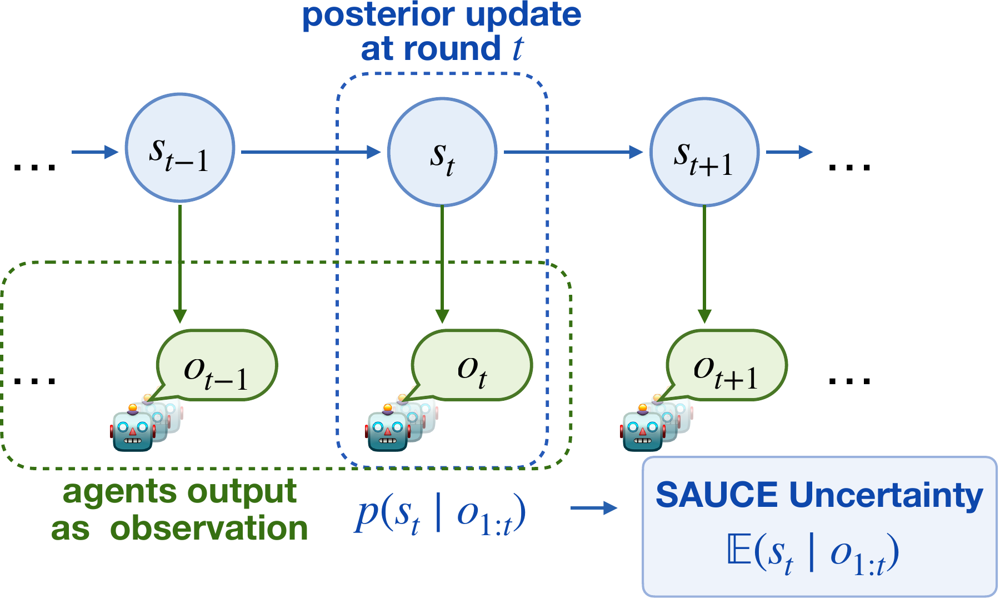
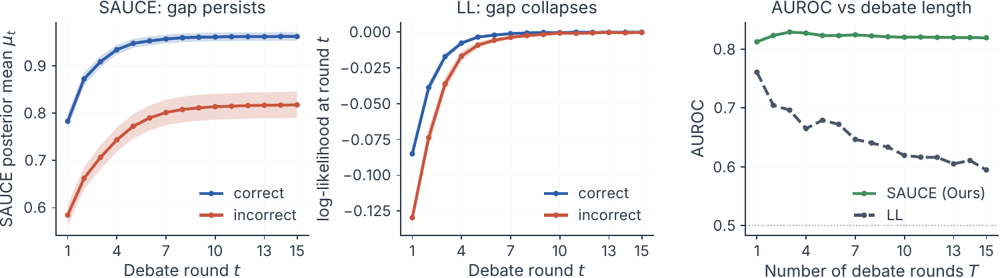
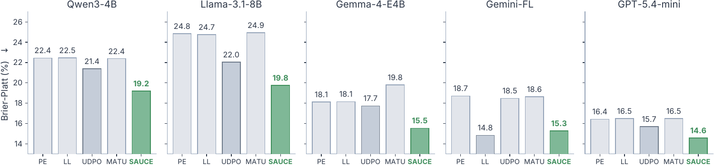

<h1 align="center">
  
</h1>

<h2 align="center">Accepted at NeurIPS 2026</h2>

<p align="center">
  <strong>🧭 Sequential Agent Uncertainty through Consensus Evolution</strong>
</p>

<h2 align="center">
  Sequential Probabilistic Uncertainty Estimation<br>
  for Parallel Multi-Agent Reasoning Systems
</h2>

<p align="center">
  Tunyu Zhang · Zihao Zhao · Yusong Zhao · Haizhou Shi<br>
  Zhuohang Li · Haoxian Chen · Hao Wang · Dimitris N. Metaxas
</p>

<p align="center">
  
  <a href="https://huggingface.co/datasets/Tyrion279/SAUCE-Qwen3-4B-Rollouts"></a>
  
  <a href="LICENSE"></a>
</p>

<p align="center">
  <a href="#quick-start">Quick start</a> ·
  <a href="#method">Method</a> ·
  <a href="#experimental-highlights">Results</a> ·
  <a href="#rollout-dataset">Dataset</a> ·
  <a href="#reproduce-paper-results">Reproduce results</a> ·
  <a href="#api">API</a> ·
  <a href="#citation">Citation</a>
</p>

---

SAUCE estimates uncertainty from the **interaction history** of a multi-agent
reasoning system. It combines agreement and token entropy across rounds
through a lightweight sequential update. The Python API accepts saved signals
or signals from your own agents.

## Quick start

### Install

Requires Python **3.10+**:

```bash
git clone https://github.com/Tyrion58/SAUCE.git
cd SAUCE
python -m pip install .
```

### Score a trajectory

Pass one agreement value and one mean token entropy for each executed round:

```python
from sauce import sauce

result = sauce(
    agreement=[2 / 3, 1.0, 1.0],
    token_entropy=[0.4, 0.2, 0.1],
    protocol="debate",
)
print(f"Uncertainty: {result['score']:.6f}")  # -0.625135
```

**Higher scores indicate greater uncertainty.** The score is a ranking
signal, rather than an error probability. Use `sauce_score(...)` for a scalar
return value, or inspect `result["trace"]` for the posterior history.
Set `protocol="dylan"` to use the DyLAN preset.

For a runnable synthetic example:

```bash
python examples/simple_usage.py
```

## Method

<p align="center">
  <a href="assets/sauce_method.pdf">
    
  </a>
  <br>
  <em>Sequential inference over the interaction history. Click for the vector PDF.</em>
</p>

Each round supplies two signals:

- **Agreement $M_t$:** the modal parsed-answer count divided by the initial team size.
- **Token entropy $R_t$:** mean generation entropy across the agents in that round.

SAUCE propagates the previous posterior and updates it with the current
agreement. Higher token entropy reduces the weight of the new observation.
The trajectory score averages the posterior means across executed rounds:

$$
u(\tau) = -\frac{1}{T}\sum_{t=1}^{T}\mu_t.
$$

## Experimental highlights

### Ranking quality across five backbones

Per-backbone averages from the paper's main results. Each cell reports
**AUROC / AUARC** in percentage units; higher is better. Each average covers
three benchmarks under both Debate and DyLAN.

| Backbone | PE | LL | UDPO | MATU (N=1) | **SAUCE** |
|---|---:|---:|---:|---:|---:|
| Qwen3-4B | 63.43 / 80.94 | 66.79 / 82.74 | 63.35 / 79.25 | 60.66 / 80.64 | **73.50 / 85.47** |
| Llama-3.1-8B-Instruct | 50.77 / 51.97 | 52.44 / 53.20 | 67.72 / 66.99 | 62.18 / 62.62 | **76.84 / 73.61** |
| Gemma-4-E4B-it | 62.88 / 85.30 | 66.77 / 86.82 | 65.00 / 85.51 | 61.41 / 85.69 | **76.38 / 90.66** |
| Gemini-2.5-Flash-Lite | 57.08 / 54.95 | 59.88 / 56.94 | 65.29 / 55.43 | 61.88 / 58.97 | **75.77 / 64.71** |
| GPT-5.4-mini | 55.38 / 52.14 | 59.84 / 54.17 | 63.50 / 51.62 | 56.64 / 53.51 | **68.42 / 59.06** |

Open-source backbones use MATH-500, MMLU-Pro, and BBH; closed-source
backbones use OlympiadBench, MMLU-Pro, and BBEH-mini. PE denotes predictive
entropy and LL denotes log-likelihood. These are averages within each
backbone's evaluation suite.

### Why the sequential update matters

Component ablation on **Qwen3-4B / MMLU-Pro / Debate**, as reported in the
paper. Brier-Platt is the Brier score after Platt scaling with five-fold
cross-validation; both columns use percentage units.

| Estimator | AUROC ↑ | Brier-Platt ↓ |
|---|---:|---:|
| Last-round agreement | 58.4 | 21.3 |
| Mean agreement across rounds | 68.6 | 20.0 |
| Static precision-weighted agreement using token entropy | 68.4 | 20.9 |
| **SAUCE: full sequential update** | **77.1** | **19.2** |

Combining the two signals through a static weighted average performs similarly
to mean agreement in this setting. The sequential update raises AUROC to 77.1.

### Longer debates

<p align="center">
  <a href="assets/round_dynamics.pdf">
    
  </a>
  <br>
  <em>Qwen3-4B / MMLU-Pro / Debate, up to 15 rounds. Click for the vector PDF.</em>
</p>

In this longer-debate experiment, SAUCE preserves separation between correct
and incorrect trajectories as agents become more token-confident.
Its AUROC remains stable after the first few rounds, while the last-round
log-likelihood baseline loses discrimination.

### Calibration

<p align="center">
  <a href="assets/calibration.pdf">
    
  </a>
  <br>
  <em>MMLU-Pro / Debate. Brier score after Platt scaling with five-fold cross-validation; lower is better.</em>
</p>

SAUCE has the lowest Brier-Platt score on four of the five backbones in
this paper experiment.

The [released Qwen rollouts](#rollout-dataset) and
[evaluation example](#reproduce-paper-results) below let you recompute the
six main Qwen3-4B AUROC/AUARC settings.

## Rollout dataset

**[🤗 SAUCE Qwen3-4B Rollouts on Hugging Face](https://huggingface.co/datasets/Tyrion279/SAUCE-Qwen3-4B-Rollouts)**

The release contains **27,564 trajectories and 176,898 agent responses**
across six settings, approximately **66 MB** compressed.

| Benchmark | Trajectories per protocol | Hugging Face configurations |
|---|---:|---|
| MATH-500 | 500 | `debate_math_500`, `dylan_math_500` |
| MMLU-Pro | 12,032 | `debate_mmlu_pro`, `dylan_mmlu_pro` |
| BBH, five tasks | 1,250 | `debate_bbh`, `dylan_bbh` |

**`round_outputs` contains every executed round**, including each agent's
response and parsed answer. Debate records contain three rounds; DyLAN records
contain one to three rounds, depending on early stopping.
`agent_final_answers` is a separate view of the last round.

### Download and score

From the repository root:

```bash
# Download MATH-500 / Debate and score five trajectories.
python examples/download_rollouts.py
python examples/score_rollouts.py

# Download all six settings.
python examples/download_rollouts.py --all
```

The downloader pins `qwen-rollouts-v1` and checks file hashes. To score an
entire setting and save a CSV:

```bash
python examples/score_rollouts.py datasets/qwen3_4b/dylan_mmlu_pro.jsonl.gz \
  --limit 0 > scores.csv
```

### Load with Hugging Face Datasets

Alternatively, install `datasets` and access records directly:

```bash
python -m pip install datasets
```

```python
from datasets import load_dataset
from sauce import sauce_score

records = load_dataset(
    "Tyrion279/SAUCE-Qwen3-4B-Rollouts",
    "debate_math_500",
    split="test",
    revision="qwen-rollouts-v1",
)
record = records[0]
print([rd["round_index"] for rd in record["round_outputs"]])  # [0, 1, 2]

score = sauce_score(
    record["signals"]["agreement"],
    record["signals"]["token_entropy"],
    protocol=record["protocol"],
)
```

Use the saved `signals` when scoring these records. Field definitions and
quality annotation conventions are in the
[dataset card](https://huggingface.co/datasets/Tyrion279/SAUCE-Qwen3-4B-Rollouts).

## Reproduce paper results

The evaluation example recomputes **Qwen3-4B AUROC and AUARC** for the six
released settings. It scores saved trajectories with the protocol presets
and checks the stored consensus against the reference answer.

```bash
# Install the answer-checking dependency used by this example.
python -m pip install ".[reproduce]"

# Download the versioned data.
python examples/download_rollouts.py --all

# Evaluate all six settings and save the results.
python examples/reproduce_paper.py --dataset all --protocol all \
  --output artifacts/qwen_results.json
```

To evaluate one setting:

```bash
python examples/reproduce_paper.py --dataset mmlu_pro --protocol debate
```

Expected results, in **percentage units**:

| Benchmark | Debate AUROC | Debate AUARC | DyLAN AUROC | DyLAN AUARC |
|---|---:|---:|---:|---:|
| MATH-500 | 68.81 | 84.12 | 73.11 | 85.60 |
| MMLU-Pro | 77.05 | 82.72 | 78.14 | 83.37 |
| BBH | 73.68 | 89.09 | 70.18 | 87.93 |

The script prints `PASS` when the sample count and both metrics match the
paper's displayed precision, and exits with a nonzero status on a mismatch.
The JSON output records the metrics, comparisons, and `math-verify` version.

Answer checking uses normalized letter matching for multiple-choice answers
and `math-verify==0.8.0` for other answers. AUROC treats lower uncertainty as
predicting correctness; AUARC averages retained accuracy across coverage
levels, preserving file order for score ties. The evaluation includes records
carrying quality flags.

## API

| Function | Use |
|---|---|
| `sauce(agreement, token_entropy, ...)` | Return the uncertainty score and posterior trace |
| `sauce_score(agreement, token_entropy, ...)` | Return the scalar uncertainty score |
| `majority_margin(parsed_answers, n_agents=None)` | Construct an agreement signal from parsed answers |
| `compute_token_entropy(topk_logprobs)` | Compute mean token entropy from returned top-k logprobs |
| `lambda_kalman_forward(observations, R_values, ...)` | Apply the underlying scalar filter |

### Protocol presets

| Protocol | $\lambda$ | $q$ | Initial variance $v_0$ | Initial mean $\mu_0$ |
|---|---:|---:|---:|---:|
| `debate` | 0.95 | 0.10 | 0.25 | 0.0 |
| `dylan` | 0.70 | 0.001 | 0.25 | 0.0 |

Override individual parameters with `lam`, `q`, `sigma2_0`, or `mu_0`:

```python
result = sauce([2 / 3, 1.0], [0.4, 0.2], protocol="debate", q=0.05)
```

<details>
<summary><strong>Construct signals for your own agents</strong></summary>

```python
import math
from statistics import mean
from sauce import compute_token_entropy, majority_margin

agreement_t = majority_margin(["A", "A", "B"], n_agents=3)
agent_logprobs = [
    [[math.log(0.8), math.log(0.2)]],
    [[math.log(0.7), math.log(0.3)]],
    [[math.log(0.6), math.log(0.4)]],
]
entropy_t = mean(compute_token_entropy(tokens) for tokens in agent_logprobs)
```

Parse and normalize answers before computing agreement. `None` and empty
answers contribute no vote but stay in the denominator; the helper raises
`ValueError` if no answer is parseable. For DyLAN, pass the initial team size
after pruning. Two unanimous survivors from three initial agents give `2/3`.

Entropy uses natural logarithms, with probabilities renormalized over the
returned top-k alternatives. Average first over tokens, then over agents.
Missing measurements raise `ValueError`; measured zero entropy is valid.
For early-stopped trajectories, supply only the rounds that executed.

</details>

<details>
<summary><strong>Sequential update</strong></summary>

```text
mu_pred = lambda * mu
variance_pred = lambda**2 * variance + q
gain = variance_pred / (variance_pred + R_t + epsilon)
mu = mu_pred + gain * (M_t - mu_pred)
variance = (1 - gain) * variance_pred
score = -mean(mu_t over the trajectory)
```

The scorer floors entropy at `1e-8`, adds `1e-8` to the gain denominator,
and floors posterior variance at `1e-15`. The trace includes per-round `mu`,
`sigma2`, `K_t`, `S_t`, and `nu_t`, plus final and mean posterior values.

</details>

## Citation

```bibtex
@inproceedings{zhang2026sauce,
  title     = {Sequential Probabilistic Uncertainty Estimation for Parallel Multi-Agent Reasoning Systems},
  author    = {Zhang, Tunyu and Zhao, Zihao and Zhao, Yusong and Shi, Haizhou and
               Li, Zhuohang and Chen, Haoxian and Wang, Hao and Metaxas, Dimitris N.},
  booktitle = {Advances in Neural Information Processing Systems},
  year      = {2026}
}
```

See [CITATION.cff](CITATION.cff) for machine-readable citation metadata and
[benchmark attribution](datasets/qwen3_4b/NOTICE.md) when using the rollout data.

## Development

```bash
python -m pip install -e ".[reproduce]"
python -m unittest discover -s tests -v
```

## License

SAUCE code and our rollout contributions use the [MIT License](LICENSE).
Benchmark content retains its [upstream notices](datasets/qwen3_4b/NOTICE.md).
